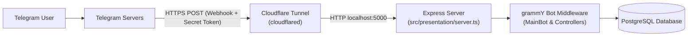

# PokeBotShowdown

A Telegram bot to catch, evolve, and trade Pokemon with your friends.

## What it does

- Register users and choose a starter Pokemon.
- Spawn wild Pokemon encounters and catch them.
- View and manage your Pokemon collection.
- Evolve Pokemon.
- Player-to-player Pokemon trading.
- Delete account and related user data.

---

## Architecture & Why a Reverse Proxy is Needed

PokeBotShowdown operates exclusively in **Webhook Mode** via Express and grammY (`src/presentation/server.ts`).

Unlike _Long Polling_ (where the bot periodically asks Telegram for updates), in Webhook mode:

1. When the bot starts, it registers its public HTTPS URL with Telegram's API via `setWebhook`.
2. Every time a user interacts with the bot on Telegram, Telegram's servers send an HTTP `POST` request directly to that URL.
3. Telegram **requires** this endpoint to be publicly accessible over the internet with a valid **HTTPS** SSL/TLS certificate.
4. During local development, your computer is behind a local router/NAT (`localhost:5000`) without a public IP or SSL certificate.

To bridge this gap, a **reverse proxy / tunnel** like **Cloudflare Tunnel (`cloudflared`)** exposes your local port `5000` to a secure public HTTPS URL (e.g., `https://<random-id>.trycloudflare.com`).



---

## Requirements

Before starting, ensure you have the following installed on your machine:

- **Node.js**: 22+ (CI uses Node 26)
- **pnpm**: 10.x (`corepack enable pnpm`)
- **Docker & Docker Compose**: for running PostgreSQL (and optional containerized bot)
- **Telegram Bot Token**: from [@BotFather](https://t.me/botfather)
- **Cloudflare Tunnel (`cloudflared`)**: for exposing your local development server to Telegram

---

## Installing `cloudflared` (From Scratch)

If you are setting up a fresh development machine and do not have `cloudflared` installed:

### Linux

- **Debian / Ubuntu / Pop!\_OS / Linux Mint**:

  ```bash
  curl -L --output cloudflared.deb https://github.com/cloudflare/cloudflared/releases/latest/download/cloudflared-linux-amd64.deb
  sudo dpkg -i cloudflared.deb && rm cloudflared.deb
  ```

- **Fedora / RHEL / Rocky Linux**:

  ```bash
  sudo dnf install -y https://github.com/cloudflare/cloudflared/releases/latest/download/cloudflared-linux-x86_64.rpm
  ```

- **Arch Linux / Manjaro**:
  ```bash
  sudo pacman -S cloudflared
  ```

### macOS

Using [Homebrew](https://brew.sh):

```bash
brew install cloudflare/cloudflare/cloudflared
```

### Windows

Using Windows Package Manager (PowerShell as Administrator):

```powershell
winget install --id Cloudflare.cloudflared
```

_Or using Chocolatey:_

```powershell
choco install cloudflared
```

### Verify Installation

```bash
cloudflared --version
```

---

## Local Setup (Step-by-Step)

Follow these steps in chronological order:

### 1. Clone & Install Dependencies

```bash
git clone <repository-url>
cd pokeshowdown_bot
pnpm install
```

### 2. Prepare Environment File

Copy the template environment file:

```bash
cp env-sample.env .env
```

Open `.env` and fill in:

- `API_KEY`: Your Telegram Bot API token obtained from [@BotFather](https://t.me/botfather).
- `WEBHOOK_SECRET`: A random secret token (1-256 characters) used to verify that incoming webhook requests genuinely originate from Telegram. You can generate one via:
  ```bash
  openssl rand -hex 32
  ```

Leave `WEBHOOK_URL` empty for now; you will obtain it in the next step.

### 3. Start the Cloudflare Tunnel

Open a dedicated terminal window (keep it running throughout your development session):

```bash
pnpm tunnel
# or: cloudflared tunnel --url http://localhost:5000
```

> [!NOTE]
> This command starts a **Cloudflare Quick Tunnel** (TryCloudflare). It requires **no Cloudflare account**, no login, and no custom domain.
>
> In the console output, look for a line containing your public HTTPS tunnel URL:
>
> ```text
> +--------------------------------------------------------------------------------------------+
> |  Your quick Tunnel has been created! Visit it at (it may take some time to be reachable):  |
> |  https://orange-apples-random-words.trycloudflare.com                                      |
> +--------------------------------------------------------------------------------------------+
> ```

### 4. Set `WEBHOOK_URL` in `.env`

Copy the HTTPS URL output by `cloudflared` into `.env`:

```env
WEBHOOK_URL="https://orange-apples-random-words.trycloudflare.com"
```

---

### 5. Start the Application

Choose **one** of the two workflows below:

#### Workflow A: Host Development (Recommended)

In this workflow, PostgreSQL runs in a lightweight Docker container while the bot runs directly on your host machine with instant TypeScript hot-reloading (`tsx watch`).

1. **Start PostgreSQL in Docker**:
   ```bash
   docker compose up -d db
   ```
2. **Generate Prisma Client & Apply Migrations**:
   ```bash
   pnpm run prisma:generate
   pnpm run prisma:migrate
   ```
3. **Run the Bot in Development Mode**:
   ```bash
   pnpm dev
   ```

You will see:

```text
COMMANDS REGISTERED
Server running on port 5000
```

#### Workflow B: Full Docker Development

In this workflow, both PostgreSQL and the bot run in Docker containers.

```bash
docker compose up -d
```

This starts the `db` and `dev` containers, generates the Prisma client, runs migrations, and boots the bot on port `5000`.

> [!IMPORTANT]
> If your Cloudflare Tunnel restarts and issues a new URL, you must update `WEBHOOK_URL` in `.env` and recreate the container:
>
> ```bash
> docker compose up -d --force-recreate dev
> ```
>
> (`docker compose restart` does **not** reload `.env` values in existing containers).

---

## Verifying the Webhook

To confirm that Telegram successfully registered your webhook URL:

```bash
curl -s "https://api.telegram.org/bot<YOUR_API_KEY>/getWebhookInfo"
```

Expected JSON response:

```json
{
  "ok": true,
  "result": {
    "url": "https://orange-apples-random-words.trycloudflare.com",
    "has_custom_certificate": false,
    "pending_update_count": 0
  }
}
```

Now open Telegram, search for your bot, and send `/start`.

---

## Alternative Tunneling Tools

While `cloudflared` is the primary and recommended tool, you can use these alternatives if preferred:

### Pinggy (SSH - Zero Installation)

Requires no tools installed beyond an SSH client:

```bash
ssh -p 443 -R0:localhost:5000 a.pinggy.io
```

Copy the resulting `https://...` URL into `WEBHOOK_URL` in `.env`.

### ngrok

```bash
ngrok http 5000
```

Copy the generated `https://...ngrok-free.app` URL into `WEBHOOK_URL` in `.env`.

---

## Troubleshooting

- **`Error: WEBHOOK_URL is not defined`**:
  Make sure you started your tunnel, copied the HTTPS URL, and saved it into `.env` under `WEBHOOK_URL`.
- **Tunnel URL changed on restart**:
  Quick tunnels assign a new random URL each time `cloudflared` is restarted. Whenever this happens, paste the new URL into `WEBHOOK_URL` in `.env` and restart your bot (`pnpm dev` or `docker compose up -d --force-recreate dev`).
- **Port 5000 already in use**:
  Ensure you are not running both `pnpm dev` on the host and the `dev` service in Docker Compose simultaneously. Stop one before running the other (`docker compose stop dev`).
- **Telegram updates not arriving**:
  Check `getWebhookInfo` via the curl command above. If `last_error_message` is present in the response, Telegram will describe why the delivery failed (e.g., timeout or SSL handshake error).
- **`generated/` or `postgres/` permission issues**:
  Files written by Docker containers may be owned by `root`. If running on host after Docker, you may need to adjust ownership: `sudo chown -R $USER:$USER generated/`.

---

## Bot Commands

All commands are case sensitive and must start with `/`.

| English Command     | Spanish Alias      | Description                                      |
| :------------------ | :----------------- | :----------------------------------------------- |
| `/start`            | `/comenzar`        | Start the bot                                    |
| `/register`         | `/registrarse`     | Register user and choose starter Pokemon         |
| `/delete_account`   | `/borrar_cuenta`   | Delete account and associated data               |
| `/help`             | `/ayuda`           | Display command list and instructions            |
| `/generate_pokemon` | `/generar_pokemon` | Spawn a wild Pokemon encounter                   |
| `/pokemons`         | `/pokemons`        | View your Pokemon collection                     |
| `/evolve`           | `/evolucionar`     | Evolve an owned Pokemon                          |
| `/shiny`            | `/brillante`       | Make one of your pokemons shiny                  |
| `/nickname`         | `/nickname`        | Add a custom nickname to your pokemon            |
| `/trade`            | `/intercambiar`    | Trade a Pokemon with another user                |
| `/battle`           | `/batalla`         | Challenge another trainer to a turn-based battle |

---

## Tech Stack

- **Runtime**: Node.js 22+ (TypeScript ESM, `moduleResolution: nodenext`)
- **Framework**: [grammY](https://grammy.dev/) (`@grammyjs/commands`, `@grammyjs/conversations`)
- **Database**: PostgreSQL with [Prisma ORM](https://www.prisma.io/)
- **Server**: Express (Webhook middleware)
- **External API**: [pokenode-ts](https://github.com/Gabb-c/pokenode-ts) (with in-memory caching)

---

## Project Structure

```text
src/
├── domain/            # Entities, repository contracts, and domain constants
├── infrastructure/    # Prisma-backed repository implementations
├── presentation/      # Bot controllers, conversation flows, services, and Express server
prisma/                # Prisma schema and database migrations
generated/prisma/      # Auto-generated Prisma client
```
